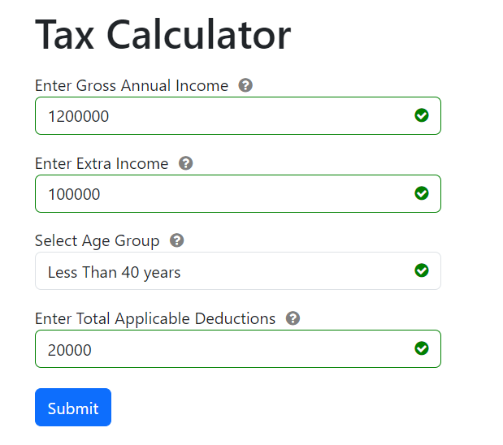

# My Addition To Edge case Validation

- If Gross Annual income, Extra income from other sources, deduction is negative, it will show an error

- If the deduction is more than the sum of Gross Annual Income and income from other sources, It show an error message

# Tax Calculator
- **Live hosted demo**- https://tax-calculator-shubham.netlify.app/

- The Tax Calculator project is a web application designed to help users calculate their taxes based on their gross annual income, extra income, age group, and applicable deductions. 
- The project utilizes HTML, CSS, and JavaScript to create an interactive and user-friendly interface for inputting and processing tax-related information.

## Features

- Extensive Form Validation
- Modal Dialog Box 
- Tool tip to display warning messages and info

## Tax Calculation Formula
- The tax calculation works based on this formula -
    - Overall income (after deductions) under 8 (≤) Lakhs is not taxed.
        - Ex - if Gross Annual Income + Extra Income - Deductions =  6 Lakhs, no tax
        - if Gross Annual Income + Extra Income - Deductions =  9 Lakhs, tax
    - Income over 8 (>) Lakhs, the amount over 8 Lakhs is taxed at
        - 30% for people with age < 40
        - 40% for people with age ≥ 40 but < 60
        - 10% for people with age ≥ 60
        - Example
            - Age = 34, Income = 40 Lakhs, no deductions, tax = .3 * (40 - 8) = .3 * 32 = 9.6 Lakhs
## Form Validations

- Highlighting a error icon to the right of the input field (shown as an example in above image as a circle with `!`). Hovering over it shows the error in a tooltip
- If no errors are present, error icon is not show instead a green 
  tick mark is shown

- The age dropdown field should have 3 values -
    - <40
    - ≥ 40 & < 60
    - ≥ 60
    - If user has not entered this value and clicks on submit, shows a error icon hovering over which should show that input field is mandatory
    
- If the deduction is more than the sum of Gross Annual Income and income from other sources, It show an error message

- If Gross Annual income, Extra income from other sources, deduction is negative, it will show an error
